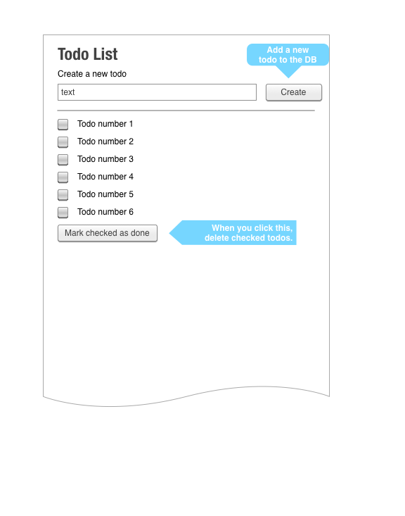

# Todo List with Flask

## Description

Use Flask to create a simple todo list.

## Objectives

### Learning Objectives

After completing this assignment, you should understand:

* Simple database usage
* Testing Flask applications

## Details

### Deliverables

* A Git repo called flask-todo containing at least:
  * `README.md` file explaining how to run your project
  * a `requirements.txt` file
  * a suite of tests for your project

### Requirements  

* Passing unit tests
* No PEP8 or Pyflakes warnings or errors

## Normal Mode

Use Flask to create a simple todo list that looks similar to the
following:

You will need to handle three situations:

* Showing the main todo list
* Submitting a new todo
* Deleting checked todos

The new todo form and current todos form should be separate HTML forms.

Your application should be tested.

## Hard Mode

In addition to the requirements from **Normal Mode**:

* Add in a way to edit current todos.
* Change the behavior from deleting checked todos to marking them as done and removing them from the page. Then add a new page to show completed todos.

## Day 2 Tasks

* Add a new field to todos for the due date. This field is not required when creating a todo.
* If a todo is overdue, display that fact somehow. You can emphasize the todo, use a Foundation label, or something else.
* Sort the todos by due date descending. The ones without a due date can be on either side of the rest of them.
* Sort the completed todos by date completed descending.
* Move the completed todos to a separate page at "/completed."

If you finish all that and you want a hard mode:

* Research foreign keys and relationships between models. Create a Note model and allow notes to be added to todos. You will likely want to make a page for each todo to show all the notes and add new ones.
